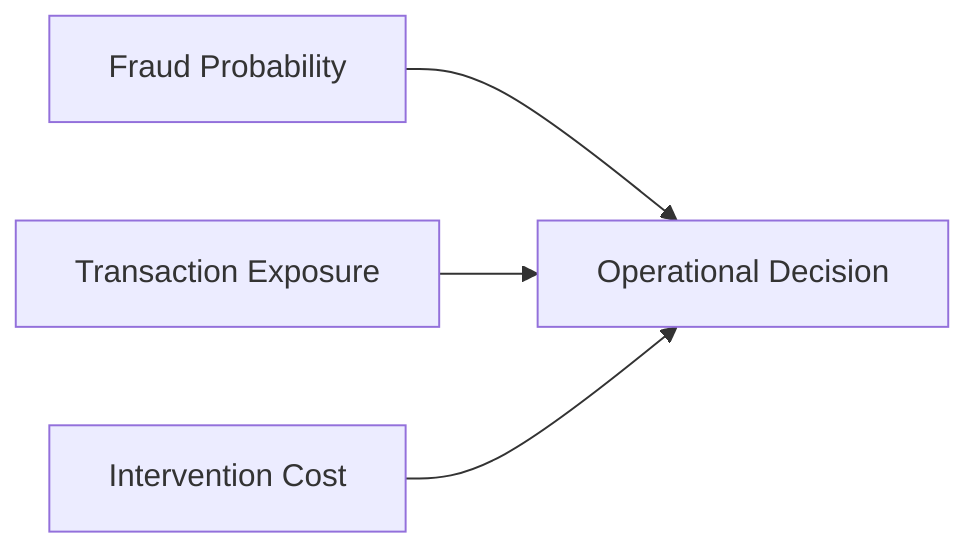
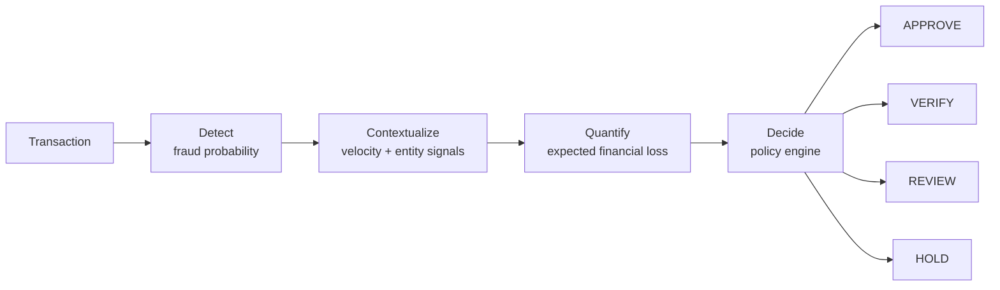
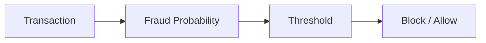
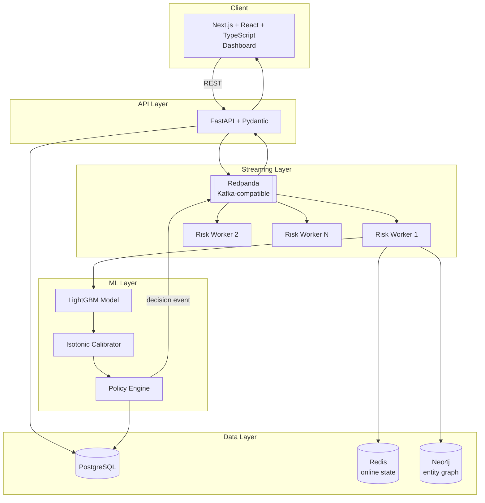
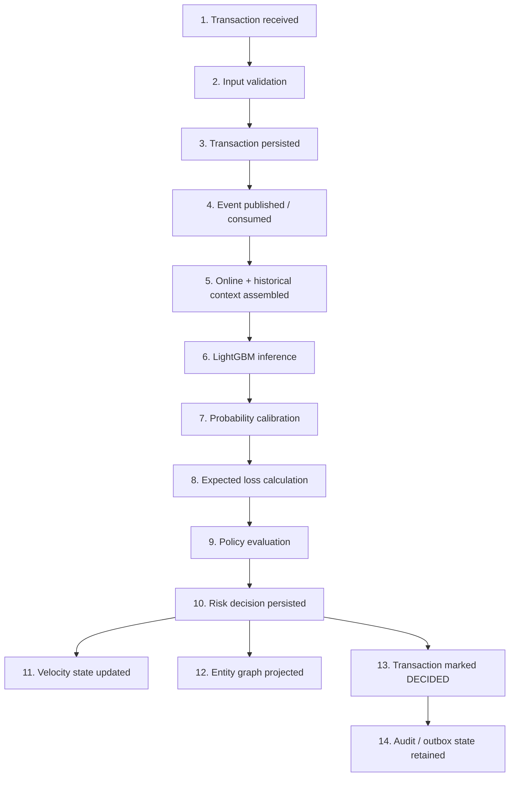
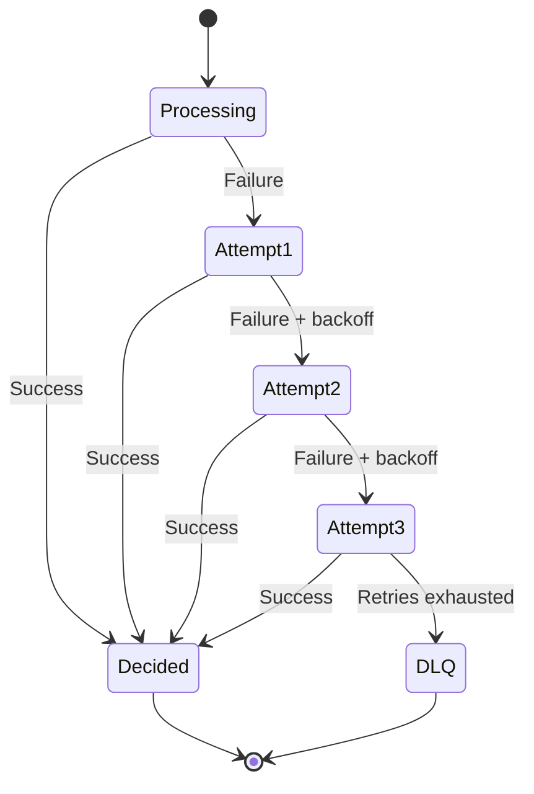
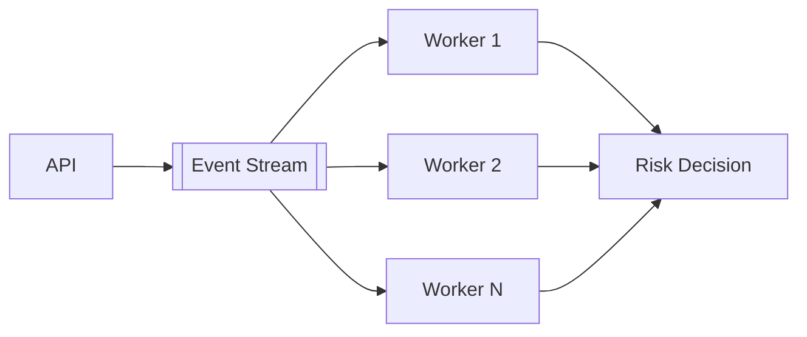
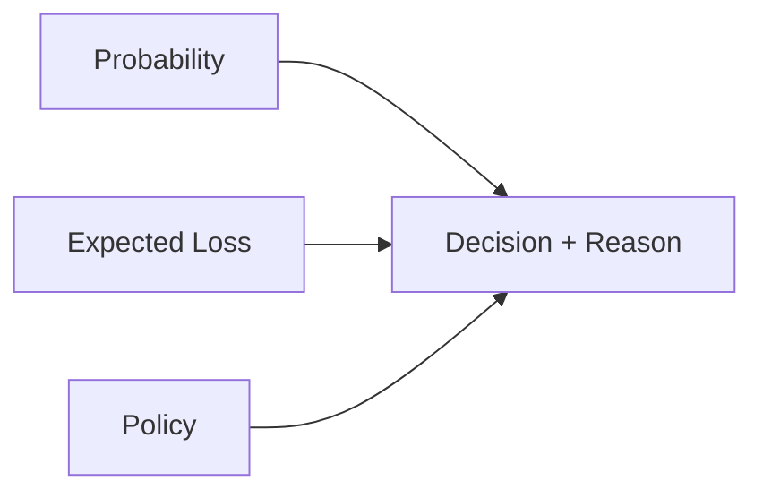

<div align="center">

# 🛡️ Risk Sentinel

### Real-time fraud loss prevention for merchants — turning transaction risk into economically-aware decisions.

**Hackathon Track 02 — AI Risk Manager** · *Fraud-Driven Transaction Loss Prevention*


[Repository](https://github.com/VISHALKUMAR872/Risk-Manager) · [Getting Started](#-getting-started) · [Architecture](#-architecture) · [Results](#-model--decisioning-results)

</div>

---

> Instead of asking **"is this transaction fraudulent?"**, Risk Sentinel asks:
> **"How risky is this transaction, how much could it cost, and what action is economically justified?"**

Risk Sentinel is a real-time fraud-risk platform that combines **calibrated machine learning, transaction velocity, entity relationships, expected-loss modeling, and a deterministic policy engine** to decide how every transaction should be handled — `APPROVE`, `VERIFY`, `REVIEW`, or `HOLD`.

## 📊 Executive Snapshot

| Metric | Result |
|---|---:|
| Production model | **LightGBM (V2)** |
| Model features | **23** |
| Future ROC-AUC | **0.840223** |
| Future PR-AUC | **0.283188** |
| Calibrated Brier score | **0.028926** |
| Calibrated ECE | **0.001725** |
| Future balanced precision | **38.7755%** |
| Future balanced recall | **24.6513%** |
| Future balanced FPR | **1.4035%** |
| Future intervention rate | **2.2127%** |
| Net modeled benefit (locked future set) | **₹49,078.28** |
| Streaming benchmark | **100 / 100 → DECIDED, 0 failures** |
| Worker completion rate | **~18 transactions/sec** |
| Model artifact size | **0.41 MB** |

> **Honesty note:** the economic and benchmark figures above are *modeled evaluation results on a locked future test split and controlled local benchmarks* — not measured production savings or cloud SLOs. See [Limitations](#-limitations) for the full picture.

## ✨ Highlights

- **Decision-first, not classification-first** — the model output is one input into an explicit expected-loss and policy layer, not the final answer.
- **Leakage-safe by construction** — every historical prior is computed strictly from transactions with an earlier `TransactionDT`, with deterministic tie-breaking on equal timestamps.
- **Calibrated probabilities** — isotonic regression drops Expected Calibration Error from 0.003644 to **0.001725** with ROC-AUC essentially unchanged, so downstream ₹ estimates are trustworthy.
- **Graph-aware context** — customer, device, IP, and payment relationships are modeled in Neo4j, not just flattened into columns.
- **Built for failure** — retries with backoff, idempotent processing, a dead-letter queue, and outbox-based event publication.
- **LLM stays in its lane** — generative explanation is available for investigators, but it never overrides the deterministic risk decision.

## Table of Contents

- [The Problem](#-the-problem)
- [The Solution](#-the-solution)
- [Why Risk Sentinel Is Different](#-why-risk-sentinel-is-different)
- [Architecture](#-architecture)
- [End-to-End Data Flow](#-end-to-end-data-flow)
- [Machine Learning Pipeline](#-machine-learning-pipeline)
- [Model & Decisioning Results](#-model--decisioning-results)
- [Reliability & Scalability](#-reliability--scalability)
- [Explainability & the LLM Boundary](#-explainability--the-llm-boundary)
- [API Reference](#-api-reference)
- [Getting Started](#-getting-started)
- [Repository Structure](#-repository-structure)
- [Model Artifacts](#-model-artifacts)
- [Roadmap](#-roadmap)
- [Limitations](#-limitations)
- [Security & Production Hardening](#-security--production-hardening)
- [Observability](#-observability)
- [Hackathon Track Alignment](#-hackathon-track-alignment)
- [Why This Matters](#-why-this-matters)

---

## 🎯 The Problem

Fraud detection is not only a classification problem. A payment system must continuously answer: **should this transaction be approved, verified, reviewed, or held?**

Every intervention has a cost:

- **Blocking** legitimate transactions creates customer friction and lost revenue.
- **Verification** introduces additional operational and customer cost.
- **Manual review** consumes scarce investigation capacity.
- **Allowing fraud through** creates direct financial loss.

A useful risk system has to balance all four at once:



**The technical challenge:** transaction risk is contextual. A transaction can look normal in isolation but suspicious when combined with customer velocity, device activity, IP activity, historical fraud rates, payment-instrument behavior, and connected entities. Naively engineered historical features also introduce a serious **data leakage risk** — Risk Sentinel addresses this with point-in-time historical priors and transaction-time replay (see [Machine Learning Pipeline](#-machine-learning-pipeline)).

## 🧩 The Solution

Risk Sentinel separates **fraud detection** from **business decisioning**. The system has four core responsibilities:



| Responsibility | What it does |
|---|---|
| **Detect** | Estimate the probability that a transaction is fraudulent. |
| **Contextualize** | Combine that prediction with real-time velocity and entity-level context. |
| **Quantify** | Translate fraud probability into expected financial loss. |
| **Decide** | Use a deterministic policy engine to pick the economically justified action. |

## 🆚 Why Risk Sentinel Is Different

Traditional fraud pipelines collapse everything into a single threshold:



Risk Sentinel separates **prediction** from **decisioning**:

| Dimension | Conventional Flow | Risk Sentinel |
|---|---|---|
| Primary output | Fraud probability | Probability + operational action |
| Decision | Threshold-based | Policy-driven |
| Financial consequence | Often implicit | Explicit expected loss |
| Context | Transaction-level | Transaction + velocity + entity + historical |
| Calibration | May be absent | Isotonic calibration |
| Historical features | Leakage risk | Point-in-time priors |
| Online state | External | Redis-backed |
| Entity context | Limited | Neo4j graph |
| Failure handling | Application-dependent | Retry + idempotency + DLQ |

The differentiator isn't "how likely is fraud" — it's **what intervention is economically justified.**

## 🏗️ Architecture

| Layer | Technology | Purpose |
|---|---|---|
| Frontend | Next.js + React + TypeScript | Risk operations dashboard |
| UI | Tailwind / shadcn | Dashboard interface |
| API | FastAPI + Pydantic | Risk and transaction APIs |
| Streaming | Redpanda | Kafka-compatible event streaming |
| Database | PostgreSQL | Durable transaction/risk state |
| Online state | Redis | Velocity and idempotency state |
| Graph | Neo4j | Entity relationship network |
| ML | LightGBM | Fraud-risk prediction |
| Calibration | Isotonic Regression | Probability calibration |
| Explainability | SHAP / reason codes | Risk interpretation |
| Infrastructure | Docker | Reproducible infrastructure |



## 🔄 End-to-End Data Flow



## 🧠 Machine Learning Pipeline

### Dataset

Risk Sentinel is trained and evaluated on an **IEEE-CIS-like public research dataset** — a research benchmark, not a production merchant dataset.

| File | Size |
|---|---:|
| `train_transaction.csv` | ~651.69 MB |
| `train_identity.csv` | ~25.3 MB |
| `test_transaction.csv` | ~584.79 MB |
| `test_identity.csv` | ~24.6 MB |
| **Total** | **~1.29 GB** |

Modeling splits:

| Split | Rows |
|---|---:|
| Training | 413,378 |
| Calibration | 88,581 |
| Future / Test | 88,581 |

### Entity Definitions (dataset-derived abstractions)

```
Customer = card1
Device   = DeviceInfo
IP       = addr1 + "_" + addr2
Payment  = card1 + "_" + card5 + "_" + card6
Merchant = ProductCD
```

### Leakage-Safe Historical Features

V2 introduces historical fraud priors for **customer, merchant, device, IP, and payment instrument**, under one hard constraint:

```
Historical information is only valid when:
TransactionDT (historical) < TransactionDT (current)
```

Replay ordering uses `TransactionDT` then `TransactionID`, with equal-timestamp groups handled explicitly to prevent same-time leakage. The resulting historical-prior artifact contains **590,540 rows × 28 columns**, validated with:

- ✅ No NaNs
- ✅ No duplicate transaction IDs
- ✅ 125 spot checks passing

### V2 Feature Set (23 features)

**Online behavioral signals:**
- Transaction amount
- Customer transactions / 1 minute
- Customer transactions / 1 hour
- Device transactions / 1 hour
- IP transactions / 1 hour
- Customer degree
- Device customer count
- IP customer count

**Extended with:** historical entity-level fraud priors (customer, merchant, device, IP, payment instrument).

## 📈 Model & Decisioning Results

### Model Benchmark

Three models were benchmarked on the V2 prior-feature dataset:

| Model | ROC-AUC | PR-AUC | Training Time |
|---|---:|---:|---:|
| CatBoost | 0.829357 | 0.247866 | ~48 sec |
| XGBoost | 0.833574 | 0.265079 | ~135.95 sec |
| **LightGBM** | **0.840223** | **0.283188** | **12.30 sec** |

LightGBM was selected as the **V2 production model** — a **+1.31% relative ROC-AUC** and **+14.25% relative PR-AUC** improvement over CatBoost, at a fraction of the training time.

### Calibration

Fraud probabilities feed directly into expected-loss calculations, so calibration quality matters as much as discrimination. Risk Sentinel applies **isotonic regression**:

| Metric | Raw LightGBM | Calibrated |
|---|---:|---:|
| ROC-AUC | 0.840223 | 0.840091 |
| PR-AUC | 0.283188 | 0.266300 |
| Brier Score | 0.028849 | 0.028926 |
| **ECE** | 0.003644 | **0.001725** |

ECE improves by more than 2x while discrimination (ROC-AUC) stays essentially flat — the calibrated model is just as good at ranking risk, but its probabilities can now be trusted as real-world likelihoods.

### Expected Loss Decisioning

```
Expected Loss = Fraud Probability × Transaction Exposure × Loss Given Fraud
```

| Parameter | Value |
|---|---:|
| Loss Given Fraud (LGF) | 80% |
| VERIFY cost | ₹20 |
| REVIEW cost | ₹75 |
| HOLD cost | ₹150 |

The policy layer then decides whether an intervention is economically justified.

### Policy Optimization

| Policy | Precision | Recall | FPR | Intervention Rate | Dataset |
|---|---:|---:|---:|---:|---|
| LOW_FRICTION | 64.92% | 12.23% | 0.2350% | 0.6469% | Calibration |
| BALANCED | 41.54% | 19.53% | 0.9773% | 1.6143% | Calibration |
| MAX_RECALL | 41.24% | 19.72% | 0.9995% | 1.6426% | Calibration |
| LOW_FRICTION | 62.24% | 12.62% | 0.2760% | 0.7056% | **Locked future** |
| **BALANCED** | **38.78%** | **24.65%** | **1.4035%** | **2.2127%** | **Locked future** |

> **Generalization check:** the balanced policy's FPR moved from 0.9773% on calibration data to 1.4035% on the locked future set. That gap is reported exactly, not smoothed over — threshold performance does not perfectly transfer from calibration to future data, and any production deployment should re-validate thresholds on a rolling basis.

### Locked Future Evaluation

Evaluated on **88,581** future transactions containing **3,083** fraud cases (3.48% prevalence):

| | Actual: Fraud | Actual: Legitimate |
|---|---:|---:|
| **Intervention** | 760 | 1,200 |
| **No Intervention** | 2,323 | 84,298 |

**Precision = 38.7755% · Recall = 24.6513% · FPR = 1.4035%**

### Economic Evaluation

| Metric | Result |
|---|---:|
| Modeled loss avoided | ₹88,278.28 |
| Intervention cost | ₹39,200 |
| **Net modeled benefit** | **₹49,078.28** |

These are **modeled** evaluation results on the locked future set, not measured production savings.

### LGF Sensitivity

The economic model was stress-tested across different Loss-Given-Fraud assumptions:

| LGF | Loss Avoided | Net Modeled Benefit |
|---:|---:|---:|
| 0.60 | ₹66,208.71 | ₹27,008.71 |
| 0.70 | ₹77,243.49 | ₹38,043.49 |
| **0.80** (baseline) | **₹88,278.28** | **₹49,078.28** |
| 0.90 | ₹99,313.06 | ₹60,113.06 |
| 1.00 | ₹110,347.85 | ₹71,147.85 |

## ⚙️ Reliability & Scalability

### Streaming Benchmark

A controlled local benchmark processed **100 valid transactions**:

- **100 / 100 → DECIDED**
- **0** observed processing failures
- Worker completion rate: **~18 transactions/sec**
- Producer-side event rate: ~3,199.57 events/sec *(not worker throughput)*

A separate 200-event benchmark reported an average decision latency of **~97.9 ms**:

| Percentile | Latency |
|---|---:|
| p50 | 50–100 ms |
| p95 | 100–250 ms |
| p99 | 500 ms – 1 s |

> These are controlled local measurements, not cloud production SLOs.

### Reliability Mechanisms

- **Retry** — up to three attempts with backoff before falling back to the DLQ.
- **Idempotency** — repeated events never create duplicate logical decisions.
- **Dead Letter Queue (DLQ)** — events that exhaust retries are routed for manual handling.
- **Outbox pattern** — database-to-stream publication is durable by design.



### Scalability

Event-driven processing decouples ingestion from asynchronous risk computation, giving a natural path to horizontal worker scaling:



The production LightGBM artifact is **~0.41 MB**, and the current controlled benchmark demonstrates ~18 worker-completed transactions/sec with 100/100 events reaching DECIDED — current local behavior, not a guaranteed production capacity figure.

## 🔍 Explainability & the LLM Boundary

Risk Sentinel separates **risk computation** from **risk explanation**. The authoritative decision path is always:



Example reason code: `ELEVATED_EXPECTED_LOSS`

**LLM boundary:** the LLM is *not* the authoritative fraud decision-maker. It's reserved for investigation and explanation workflows — its output may assist a human investigator, but it must never override the deterministic risk decision.

## 🔌 API Reference

| Endpoint | Description |
|---|---|
| `GET /health` | Liveness check |
| `GET /ready` | Readiness check |
| `GET /transactions` | List transactions |
| `GET /transactions/{id}` | Transaction detail |
| `GET /transactions/{id}/risk` | Risk decision for a transaction |
| `GET /transactions/{id}/network` | Entity network for a transaction |
| `GET /transactions/dashboard` | Dashboard feed |
| `GET /transactions/dashboard/summary` | Dashboard summary |

FastAPI + Pydantic provide typed request/response validation. **Production authentication and rate limiting remain hardening requirements** — see [Security & Production Hardening](#-security--production-hardening).

## 🚀 Getting Started

### Prerequisites

- Python 3.13
- Node.js
- Docker & Docker Compose
- Git
- [`uv`](https://github.com/astral-sh/uv)

### 1. Clone

```bash
git clone https://github.com/VISHALKUMAR872/Risk-Manager.git
cd Risk-Manager
```

### 2. Start infrastructure

```bash
docker compose up -d
```

Brings up PostgreSQL, Redis, Neo4j, Redpanda, and Qdrant.

### 3. Start the backend

```bash
uv sync
uv run uvicorn <application-module>:app --reload --port 8000
```

### 4. Start the frontend

```bash
npm install
npm run dev
```

| Service | URL |
|---|---|
| API | `http://localhost:8000` |
| Frontend env var | `NEXT_PUBLIC_API_URL=http://localhost:8000` |

## 📁 Repository Structure

```
risk-sentinel-v2/
│
├── app/
│   └── frontend/
│
├── backend/
│
├── ml/
│   ├── data/
│   ├── src/
│   │   └── risk_ml/
│   └── artifacts/
│       ├── models/
│       └── reports/
│
├── docker-compose.yml
├── pyproject.toml
├── uv.lock
├── package.json
└── README.md
```

> Large raw datasets are intentionally excluded from Git.

## 🗃️ Model Artifacts

| Artifact | Path |
|---|---|
| Production V2 model | `ml/artifacts/models/fraud_online_v2_priors_lightgbm.txt` |
| Calibration artifact | `ml/artifacts/models/fraud_online_v2_priors_lightgbm_isotonic_calibrator.joblib` |
| Policy optimization report | `ml/artifacts/reports/v2/v2_lightgbm_policy_optimization.json` |
| Policy frontier | `ml/artifacts/reports/v2/v2_lightgbm_policy_frontier.csv` |

Model size: **~0.41 MB**.

## 🗺️ Roadmap

<table>
<tr>
<td valign="top" width="50%">

**✅ Implemented**

- FastAPI risk API
- Next.js dashboard
- PostgreSQL persistence
- Redis online state
- Neo4j entity graph
- Redpanda streaming
- Asynchronous risk worker
- Retry handling
- Idempotency
- DLQ handling
- Outbox-oriented publication
- V2 historical fraud priors
- Leakage-safe temporal replay
- CatBoost / XGBoost / LightGBM benchmarking
- Isotonic calibration
- Expected-loss decisioning
- Policy optimization
- Locked future evaluation
- Reliability tests
- Controlled streaming benchmark

</td>
<td valign="top" width="50%">

**🔜 Planned / Hardening**

- API authentication
- Production rate limiting
- Explicit PII masking
- Richer SHAP frontend
- Expected-loss alert prioritization
- Policy what-if simulator
- Case-management workflow
- MLflow tracking
- Complete Grafana dashboards
- Higher-volume load testing
- Stronger production deployment controls

</td>
</tr>
</table>

## ⚠️ Limitations

Being upfront about these is part of the design, not an afterthought:

- **Dataset** — the underlying data is a public research benchmark, not a production merchant dataset.
- **Entity semantics** — customer, device, IP, payment, and merchant entities are abstractions derived from research-data fields, not verified real-world identities.
- **Generalization** — the balanced policy's FPR moved from 0.9773% (calibration) to 1.4035% (future); threshold performance does not perfectly transfer over time.
- **False positives** — 1,200 in the locked future set, at 38.78% precision.
- **False negatives** — 2,323 in the locked future set, at 24.65% recall.
- **Economic assumptions** — all ₹ figures depend on LGF = 80%, VERIFY = ₹20, REVIEW = ₹75, HOLD = ₹150; changing these assumptions changes the modeled benefit (see [LGF Sensitivity](#lgf-sensitivity)).
- **Production scale** — current latency and throughput numbers are controlled local benchmarks, not production SLOs.

## 🔐 Security & Production Hardening

**In place today:**
- API input validation
- Durable transaction state
- Audit-oriented persistence
- Retries, idempotency, DLQ handling
- Outbox-oriented event publication

**Remaining hardening:**
- [ ] API authentication
- [ ] Rate limiting
- [ ] PII masking
- [ ] Production secret management
- [ ] Expanded observability
- [ ] Higher-volume load testing

## 📡 Observability

Built on **OpenTelemetry**, **Prometheus**, and **Grafana**, tracking:

- Transaction latency
- Worker failures
- Retry counts
- DLQ events
- Decision distribution
- Stream health
- Model behavior

## 🏆 Hackathon Track Alignment

| Criterion | How Risk Sentinel Addresses It |
|---|---|
| Innovation | Economic decisioning rather than probability alone |
| Technical Depth | Streaming + ML + calibration + online state + graph |
| AI/ML Differentiation | Leakage-safe historical priors + multi-model benchmarking |
| Model Quality | 0.840223 ROC-AUC / 0.283188 PR-AUC |
| Calibration | ECE 0.001725 |
| Business Impact | ₹49,078.28 net modeled benefit |
| Scalability | Event-driven architecture + horizontal workers |
| Reliability | Retry + idempotency + DLQ + outbox |
| Explainability | Deterministic reason codes + separated explanation layer |
| Production Potential | Durable state + streaming + online features |

## 💡 Why This Matters

Most fraud systems begin and end with:

> *"Is this transaction fraudulent?"*

Risk Sentinel asks the operationally more useful question:

> *"Given the probability of fraud, the transaction exposure, the available context, and the cost of intervention — what should we do?"*

That single shift in framing drives the entire architecture, from leakage-safe feature engineering through calibration, expected-loss modeling, and deterministic policy evaluation.

| Metric | Result |
|---|---:|
| ROC-AUC | 0.840223 |
| PR-AUC | 0.283188 |
| Calibrated ECE | 0.001725 |
| Future Precision | 38.7755% |
| Future Recall | 24.6513% |
| Future FPR | 1.4035% |
| Net Modeled Benefit | ₹49,078.28 |

Risk Sentinel doesn't claim to eliminate fraud. It provides a **measurable, explainable, and economically-aware framework** for deciding what to do about it.
